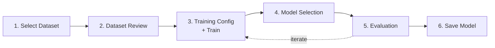
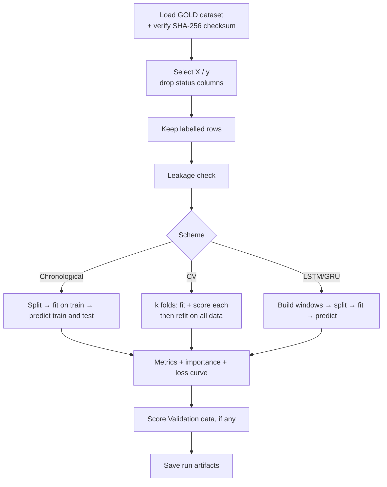

# Model Development Workflow — Data Science Guide

A guide for data scientists: how a soft-sensor model is developed in this system, what happens
to the data at each step, what is calculated, and how to read the results.

Implementation lives in `images/trainer/app/`, and file references point there. Infrastructure
details are in the [Appendix](#appendix--how-the-trainer-runs).

---

## 0. The problem we are solving

A **soft sensor** estimates a hard-to-measure process variable (the **target**, `y`), such as a lab
quality value, from process tags that are measured continuously (the **features**, `X`), such as
temperatures, pressures and flows from the PI historian.

| Property           | In this system                                                                                                                       |
| ------------------ | ------------------------------------------------------------------------------------------------------------------------------------ |
| Task type          | Supervised **regression** with a single target                                                                                       |
| Time convention    | **Nowcast**: predict `y` at time _t_ from `X` at time _t_ (plus the past, for LSTM/GRU). It does not forecast the future.            |
| Typical data shape | Features on a regular grid (for example 1-minute or hourly); the target is often **sparse** (lab samples arrive a few times per day) |
| Quality flags      | Each tag can carry a `<tag>__status` column; `0` = Good                                                                              |
| Units              | Predictions are returned in the target's engineering units, so the target must not be scaled                                         |

---

## 1. Workflow at a glance

The Create Model wizard has six steps. The data-science stages map onto them like this:



| Wizard step        | Data-science stage             | Key question                                                                 |
| ------------------ | ------------------------------ | ---------------------------------------------------------------------------- |
| 1. Select Dataset  | Data sourcing                  | Which prepared (GOLD) dataset, with which features, target and period?       |
| 2. Dataset Review  | Exploratory data analysis      | Is the data fit to model: coverage, quality, correlation, Validation data?   |
| 3. Training Config | Experiment design and training | Which target, split, algorithm(s) and hyperparameters?                       |
| 4. Model Selection | Model comparison               | Which candidate run is best on the chosen metric?                            |
| 5. Evaluation      | Diagnostics                    | Does the model generalise? Are the errors unbiased? Which features drive it? |
| 6. Save Model      | Commit                         | Keep this model as a version (optionally deploy it)                          |

**Nothing is saved as a Model until step 6.** Training and evaluation create _runs_ and _artifacts_
only, so you can experiment freely. Training runs in the background.

---

## 2. Data preparation (before training)

The dataset reaching the trainer is a **GOLD artifact**: already cleaned, resampled, feature-engineered
and (optionally) scaled by the Data Studio pipeline. Its sidecar `feature_spec.json` records how it was built:

- which scaler was fitted for each input (`scalingParams`, `scaling`)
- whether the target was scaled (`target_scaled`), which must be false
- which features were derived from the target (`derived_from_target`, for example `Y_lag1`)

### 2.1 Column roles

```
target  y  = the tag you select as Target
status     = every "<tag>__status" column           → excluded (metadata, not signal)
features X = every other column except timestamp    → used as model inputs
```

Status columns are excluded because otherwise the model could learn from the _pattern of missing
data_ instead of from the process.

### 2.2 Keep only rows with a real label — `labels.py::labelled_mask`

```
labelled = (y__status == 0)  AND  y is not NaN
           (if y__status is absent: y is not NaN)
```

This happens **before** the train/test split. It matters for sparse lab targets: a 1-minute grid
with one lab sample per day has ~1,440 rows per label. Split first, and a "20,000-row test set"
might hold only 14 real labels, making every metric misleading.

Tabular models need **at least 30 labelled rows**.

### 2.3 Target-leakage check — `guards.py::assert_no_target_leakage`

If the dataset contains features derived from the target (lags or rolling statistics of `y`):

```
label_gap      = median time between labelled rows       (minutes)
row_gap        = median time between all rows            (minutes)
rows_per_label = label_gap / row_gap

rows_per_label > 1.5  →  run refused
```

**Why:** when a daily lab value is forward-filled onto a 1-minute grid, `Y_lag1` equals the current
`y` for most rows. The model then "predicts" by copying its input and shows R² ≈ 1.0, a leak that
looks like success.
**Fix:** resample the dataset to the target's interval, or make the lag at least `rows_per_label` rows.

---

## 3. Experiment design (Step 3 — Training Config)

### 3.1 Choosing a validation scheme

Time-series data is **never shuffled**. Lag and rolling features make neighbouring rows share
information, so a random split leaks the future into training and inflates every score.

| Scheme                                      | When to use                                  | What you get                                                                                      |
| ------------------------------------------- | -------------------------------------------- | ------------------------------------------------------------------------------------------------- |
| **Chronological split** (default)           | Standard choice; enough labels               | One train/test cut, a test-set prediction series, and a loss curve (for algorithms that have one) |
| **Expanding-window CV**                     | Few labels, or you want a stability estimate | k fold scores (mean ± std) and a final model refit on all data                                    |
| **Windowed split** (automatic for LSTM/GRU) | Sequence models                              | Same as chronological, counted in windows                                                         |

#### Chronological split — `splits.py::chronological_split`

```
n     = labelled rows, sorted by time
ratio = train fraction (default 0.8)
cut   = floor(n × ratio)

train = first `cut` rows          (the past)
test  = remaining n − cut rows    (the most recent period)
```

Example: n = 1,000 and ratio = 0.8 give 800 train rows and 200 test rows. The test set is the most
recent 20 %, which mimics deploying the model on future data.

#### Expanding-window cross-validation — `splits.py::expanding_fold_plan`

Same rule as `sklearn.model_selection.TimeSeriesSplit(n_splits=k)`:

```
test_size = n // (k + 1)
fold i (0..k-1):
    train = rows [0, n − (k−i)·test_size)                         ← grows each fold
    test  = rows [n − (k−i)·test_size, n − (k−i−1)·test_size)
```

Example with n = 1,000 and k = 4:

| Fold | Train rows | Test rows |
| ---- | ---------- | --------- |
| 1    | 0–199      | 200–399   |
| 2    | 0–399      | 400–599   |
| 3    | 0–599      | 600–799   |
| 4    | 0–799      | 800–999   |

- **Maximum folds:** `k ≤ (distinct labelled y values) // 10`. A fold needs about 10 distinct target
  values to give a meaningful score; the count uses _distinct_ values, not rows, because
  forward-filled duplicates add no information.
- After scoring the k folds, the model is **refit on all labelled data**, and that refit is what you save.
- CV is available for **tabular algorithms only**, not LSTM/GRU.
- A CV run produces no single test-prediction series. Score it against Validation data later to get charts.

### 3.2 Choosing an algorithm — `models.py::build_model`

| Family | Algorithm                           | Strengths                                                                                  | Watch out for                                                  |
| ------ | ----------------------------------- | ------------------------------------------------------------------------------------------ | -------------------------------------------------------------- |
| Linear | **OLS** (`ols`)                     | Transparent baseline, interpretable coefficients                                           | Collinear tags make coefficients unstable                      |
| Linear | **Ridge** (`ridge`)                 | OLS + L2 penalty; handles correlated tags                                                  | Tune `alpha`                                                   |
| Linear | **PLS** (`pls`)                     | Classic chemometrics; compresses many correlated tags into `n_components` latent variables | `n_components` ≤ number of features                            |
| Kernel | **SVR** (`svm`)                     | Non-linear, robust to outliers (ε-insensitive loss)                                        | **Needs scaled inputs**; slow on large n                       |
| Kernel | **Gaussian Process** (`grp`)        | Smooth non-linear fits, good on small data                                                 | **Limit: 10,000 train rows** (memory grows with n²)            |
| Neural | **MLP** (`mlp`)                     | Flexible non-linear model                                                                  | Needs scaling; sensitive to hyperparameters                    |
| Neural | **LSTM / GRU** (`lstm`, `gru`)      | Uses the recent _history_ of each tag (dynamics, lags)                                     | Limit: 50,000 train windows; needs NaN-free features; slowest  |
| Trees  | **Random Forest** (`random_forest`) | Strong default, little tuning, no scaling needed                                           | Cannot extrapolate beyond the training range                   |
| Trees  | **HistGradientBoosting** (`hgb`)    | Fast boosting on large data                                                                | Same extrapolation limit                                       |
| Trees  | **LightGBM** (`lightgbm`)           | Fast, accurate boosting                                                                    | Overfits small data; tune `num_leaves` and `min_child_samples` |
| Trees  | **XGBoost** (`xgboost`)             | Accurate boosting with regularisation                                                      | Same as LightGBM                                               |

**Rules of thumb**

- Start with a **baseline**: OLS/Ridge or PLS. If a complex model barely beats it, prefer the simple one.
- **Tree models cannot extrapolate.** If the process may run outside its historical range, a linear or PLS model is safer.
- **SVR and MLP need scaled inputs.** The trainer warns when the dataset records no scaler.
- The **seed** makes stochastic algorithms reproducible (RF, boosting, MLP, GP, LSTM/GRU).

### 3.3 Default hyperparameters

| Algorithm     | Defaults                                                                                                       |
| ------------- | -------------------------------------------------------------------------------------------------------------- |
| ols           | `fit_intercept=True`                                                                                           |
| ridge         | `alpha=1.0`                                                                                                    |
| pls           | `n_components=2, max_iter=500`                                                                                 |
| svm           | `C=1.0, kernel="rbf", epsilon=0.1, tol=0.001`                                                                  |
| grp           | `alpha=1e-10, n_restarts_optimizer=0`                                                                          |
| mlp           | one hidden layer of 100 units, `alpha=1e-4, max_iter=200`                                                      |
| random_forest | `n_estimators=100, max_depth=None, min_samples_leaf=1, min_samples_split=2`                                    |
| hgb           | `learning_rate=0.1, max_iter=200, max_leaf_nodes=31, min_samples_leaf=20, l2_regularization=0`                 |
| lightgbm      | `n_estimators=100, learning_rate=0.1, num_leaves=31, max_depth=-1, min_child_samples=20, boosting_type="gbdt"` |
| xgboost       | `n_estimators=100, learning_rate=0.1, max_depth=6, subsample=1.0, colsample_bytree=1.0, min_child_weight=1`    |
| lstm / gru    | `sequence_length=24, hidden_size=64, epochs=50, batch_size=32`                                                 |

The wizard can train several algorithms or parameter variants at once ("Find Best Model" /
"Find Best Parameters"). Each variant is its own run, and you compare them in Step 4.

### 3.4 Sequence models (LSTM / GRU) in detail

**Windows** — `windows.py::build_windows`:

```
L = sequence_length (default 24 grid steps)
For each labelled row i:
    input  = features of rows [i−L+1 … i]     shape (L, n_features)
    target = y at row i
```

- Windows are cut from the **full** time grid, so 24 steps really means 24 grid intervals, even when labels are sparse.
- A row without `L` rows of history produces no window; there is no padding.
- A NaN feature inside any window stops the run. Impute upstream.

**Network** — `sequence_model.py`:

```
(L, n_features) → LSTM/GRU (1 layer, hidden_size) → last time step → Linear → ŷ
Loss: MSE      Optimizer: Adam (lr 0.001)      Mini-batches, shuffled by window each epoch
```

The train and validation loss are recorded every epoch, which gives the learning curve.

---

## 4. Training (what happens when you press Train)



- **LightGBM / XGBoost** receive the test set as an evaluation set only to record the loss curve.
  There is no early stopping, so the test set does not influence the fit.
- **CV:** the k fold models are used for scoring and then discarded. The final model is fit number k+1, trained on everything.

---

## 5. Evaluation metrics (Steps 4–5)

### 5.1 Formulas — `metrics.py::regression_metrics`

With `yᵢ` the actual value, `ŷᵢ` the prediction, `ȳ` the mean of actual values and `n` the number of samples:

```
R²   = 1 − Σ(yᵢ − ŷᵢ)² / Σ(yᵢ − ȳ)²
MAE  = (1/n) Σ abs(yᵢ − ŷᵢ)
RMSE = √[ (1/n) Σ (yᵢ − ŷᵢ)² ]
```

| Metric   | Meaning                                                                                           | Better |
| -------- | ------------------------------------------------------------------------------------------------- | ------ |
| **R²**   | Share of the target's variance explained; 0 = no better than predicting the mean; can be negative | → 1    |
| **MAE**  | Average absolute error, in target units                                                           | → 0    |
| **RMSE** | Like MAE but penalises large errors more, in target units                                         | → 0    |

`RMSE ≥ MAE` always. A large gap between them means a few big errors (outliers or regime changes).

### 5.2 Which numbers you get

| Run type                 | Reported                                                                                          |
| ------------------------ | ------------------------------------------------------------------------------------------------- |
| Chronological / LSTM-GRU | Test `r2, mae, rmse`; train `train_r2, train_mae, train_rmse`; row (or window) counts             |
| CV                       | `cv_r2_mean ± cv_r2_std`, `cv_rmse_mean ± std`, `cv_mae_mean ± std` across folds (population std) |
| With Validation data     | The same three metrics on the Validation data, plus `row_count` and `dropped_unlabelled`          |

### 5.3 Reading them

| Pattern                               | Diagnosis                                 | Action                                                                                                                 |
| ------------------------------------- | ----------------------------------------- | ---------------------------------------------------------------------------------------------------------------------- |
| train R² ≫ test R²                    | **Overfitting**                           | Simpler model, stronger regularisation (`alpha`, `min_samples_leaf`, smaller `max_depth`/`num_leaves`), fewer features |
| train and test both low               | **Underfitting**, or features lack signal | More expressive model, better features, check lag alignment                                                            |
| test good, Validation data much worse | **Drift** or period-specific fit          | Check the process regime and time coverage; consider retraining on recent data                                         |
| CV std large (e.g. RMSE 0.6 ± 0.4)    | **Unstable** across periods               | Don't trust the mean alone; look at which fold fails (CV fold table)                                                   |
| R² ≈ 1.0 suspiciously                 | **Leakage**                               | Check target-derived features and forward-filled labels                                                                |

### 5.4 Validation data

**Validation data** is a period kept completely apart from training and testing: never used to fit,
select or tune. It is the most honest estimate of real-world performance. It is scored with the
same function and the same label mask as the test set (`holdout.py::score_holdout`), so the numbers
are directly comparable.

For a **retrain**, up to three comparisons can appear:

| Series                      | Rows                                                 | Model                    | Use                                                   |
| --------------------------- | ---------------------------------------------------- | ------------------------ | ----------------------------------------------------- |
| Validation data (frozen)    | Old period, same as the current version's test slice | New candidate            | Fair comparison against the current version           |
| New-data Validation data    | Operator-selected new period                         | New candidate            | How well it handles recent data                       |
| Current version on new data | Same new period                                      | Current production model | Side-by-side check: is the candidate actually better? |

### 5.5 Diagnostic charts (Step 5)

| Chart                                  | What to look for                                                                                       |
| -------------------------------------- | ------------------------------------------------------------------------------------------------------ |
| **Actual vs Predicted** (over time)    | Tracks peaks, troughs and trends; lags behind changes?                                                 |
| **Parity scatter** (y vs ŷ)            | Points on the 45° line; a curve means systematic bias at high or low values                            |
| **Residual chart** (`y − ŷ` over time) | Random scatter around 0 is good; drift or trends mean missing dynamics or process change               |
| **Residual histogram**                 | Centred at 0, roughly symmetric; skew means bias                                                       |
| **Q-Q plot**                           | Residuals on the line means roughly normal; heavy tails mean outliers or regimes                       |
| **Loss curve**                         | Validation loss rising while train loss falls means overfitting (more epochs or trees are not helping) |
| **CV fold table**                      | Consistency across periods; a single bad fold means one unusual regime                                 |

---

## 6. Interpretability — feature importance (`importance.py`)

| Method                       | Algorithms                                    | Calculation                                                           | Interpretation                                                                                |
| ---------------------------- | --------------------------------------------- | --------------------------------------------------------------------- | --------------------------------------------------------------------------------------------- |
| **Impurity**                 | Random Forest, LightGBM, XGBoost              | Model's own `feature_importances_` (split gain or impurity reduction) | Relative usage in trees; biased toward high-cardinality features                              |
| **Coefficient**              | OLS, Ridge, linear-kernel SVR (inputs scaled) | `abs(coef_j)`; the sign is kept separately                            | Effect per one scaled unit; the sign gives the direction                                      |
| **Standardized coefficient** | Same, inputs **not** scaled                   | `abs(coef_j) × std(X_j)`                                              | Effect of a 1-standard-deviation change in the tag; comparable across tags in different units |
| **PLS coefficient**          | PLS                                           | `abs(coef_j)`                                                         | Contribution through the latent components                                                    |
| **Permutation**              | LSTM / GRU                                    | See below                                                             | Real drop in accuracy when a tag's information is destroyed                                   |

**Permutation importance** (on the test windows, 10 repeats):

```
baseline = RMSE(y, model(X))
for each feature j:
    shuffle feature j across windows → X_perm
    drop_j = RMSE(y, model(X_perm)) − baseline          (repeated 10×)
importance_j = max(0, mean(drop_j)),   std_j = std(drop_j)
```

A large positive drop means the model relies on that tag. Near 0 means it doesn't. If the std is
larger than the mean, the effect is not distinguishable from noise.

No importance table is produced for HGB, MLP, Gaussian Process or non-linear SVR.

**Caveats**

- Importance is **not causality**: correlated tags share or steal importance from each other.
- Compare importance only **within one run**, never across algorithms.
- A surprising top feature may signal **leakage**, for example a tag that is itself computed from the lab value.

---

## 7. Model selection (Step 4) and saving (Step 6)

1. Train several candidates (algorithms and/or hyperparameter variants).
2. Choose a **selection metric** (e.g. test RMSE, or R² on Validation data) and compare candidates on the same data.
3. Prefer the model that is:
   - best on **Validation data** (or on the CV mean with a small std), not just on the test set
   - **stable**: a small train/test gap and consistent folds
   - **simplest** among near-equal candidates (easier to explain and maintain)
   - **physically sensible**: its top features make process sense and the residuals show no trend
4. **Save Model** creates version 1 of the model with its artifacts. "Save & Deploy" additionally promotes it to production and enables scheduled inference.

---

## 8. Checklist

- [ ] Target is not scaled, and its `__status` column exists
- [ ] Enough labelled rows (≥ 30; more for CV: `k ≤ distinct // 10`)
- [ ] No target-derived features faster than the label rate (leakage check passes)
- [ ] Time-based split (chronological or CV), never random
- [ ] Baseline (OLS/Ridge/PLS) trained for comparison
- [ ] Scaled inputs for SVR/MLP
- [ ] Train vs test gap checked (overfitting)
- [ ] Validation data score checked (generalisation)
- [ ] Residuals centred, with no trend over time
- [ ] Top features make process sense
- [ ] Seed recorded for reproducibility (it is saved in `run_manifest.json`)

---

## 9. Outputs of a run

| File                                                                                     | Content                                                                                                | Used for                                |
| ---------------------------------------------------------------------------------------- | ------------------------------------------------------------------------------------------------------ | --------------------------------------- |
| `model.joblib`                                                                           | Trained model (for CV, the refit)                                                                      | Prediction and deployment               |
| `metrics.json`                                                                           | §5 metrics                                                                                             | Model Selection and Evaluation          |
| `predictions.parquet`                                                                    | `{timestamp, y_true, y_pred}` on the test set                                                          | Actual vs Predicted and residual charts |
| `holdout_predictions.parquet`                                                            | Same shape, on Validation data                                                                         | Validation data charts                  |
| `new_data_holdout_predictions.parquet`, `incumbent_new_data_holdout_predictions.parquet` | Candidate and current model on new-data Validation data                                                | Retrain comparison                      |
| `loss_history.json`                                                                      | Train and validation loss per iteration or epoch                                                       | Loss curve                              |
| `cv_folds.json`                                                                          | Per-fold metrics and cut timestamps                                                                    | CV fold table                           |
| `feature_importance.json`, `permutation_importance.json`                                 | §6                                                                                                     | Importance tables                       |
| `run_manifest.json`                                                                      | Dataset checksum, target, features, algorithm, hyperparameters, seed, split, metrics, library versions | Reproducibility and audit               |

---

## Appendix — how the trainer runs

- Each training run is an isolated Docker container (`images/trainer`) with 8 GiB of memory and 2 CPUs,
  running in the background, so the UI does not wait.
- It downloads the dataset over a short-lived presigned URL and verifies its **SHA-256 checksum**, so
  the model is guaranteed to be trained on exactly the recorded dataset version.
- Every step reports progress to the run log, and any failure marks the run **FAILED** with the reason.
- Scoring against Validation data is best-effort: if it fails, the run still succeeds and the Validation data metrics are simply absent.
- Libraries: scikit-learn 1.5.2, LightGBM 4.5.0, XGBoost 2.1.2, PyTorch 2.5.1 (CPU). Exact versions are stored per run.
- Changing trainer code requires rebuilding the image manually (CI does not build it). Constants
  shared with other services are listed in `app/MIRRORS.md`.
